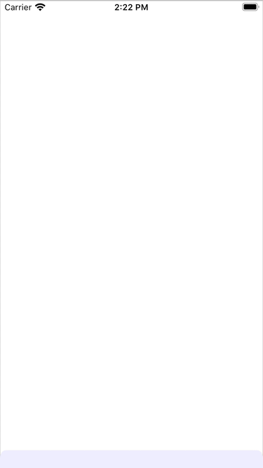

It is possible to build a view hierarchy that causes part of the dismiss animation on modal to not be preformaed causing the the view to be left in an incorrect layout.

Steps to reproduce
1. Create a UINavigationController with any rootViewController
2. Present the navigation controller modally on iOS 13 using the default style (page sheet)
3. Push another view controller with the following setup
    - Has a scrollview as a subview
    - scrollview contains a UIButton subclass that
        - sets the tint color in init to a dynamic color
        - has a subview positioned with auto layout
        - in tintColorDidChange causes layout to be run
4. Swipe to dismiss the modal

The expected behaviour is the modal is dismissed that the presenting view controller is resized to fill the screen again.

The actual behaviour is the modal is dismissed but the presenting view controller remains scaled down with black space on all sides.

This has been seen on both iOS 13 and 14 on both the simulator and real devices.

